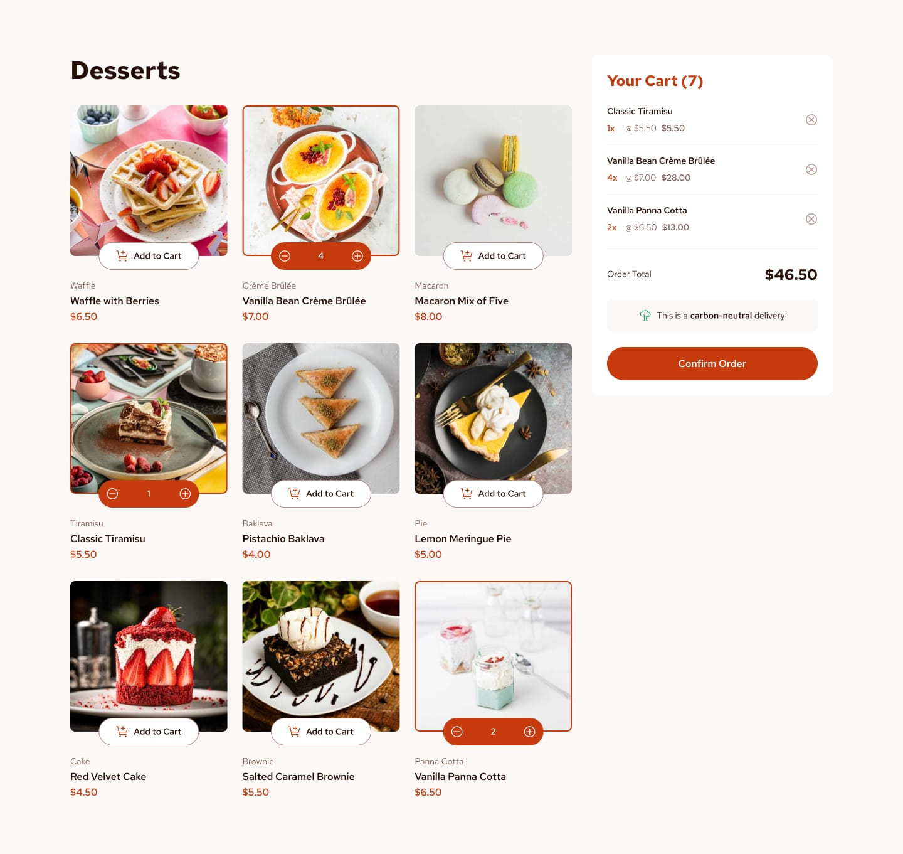

# Frontend Mentor - Product list with cart solution

This is a solution to the [Product list with cart challenge on Frontend Mentor](https://www.frontendmentor.io/challenges/product-list-with-cart-5MmqLVAp_d). Frontend Mentor challenges help you improve your coding skills by building realistic projects.

## Table of contents

- [Overview](#overview)
  - [The challenge](#the-challenge)
  - [Screenshot](#screenshot)
  - [Links](#links)
- [My process](#my-process)
  - [Built with](#built-with)
  - [What I learned](#what-i-learned)
- [Author](#author)

## Overview

### The challenge

Users should be able to:

- Add items to the cart and remove them
- Increase/decrease the number of items in the cart
- See an order confirmation modal when they click "Confirm Order"
- Reset their selections when they click "Start New Order"
- View the optimal layout for the interface depending on their device's screen size
- See hover and focus states for all interactive elements on the page

### Screenshot


*Desktop view showing the dessert shop with selected items*


*Mobile responsive design*


*Order confirmation modal*

### Links

- Solution URL: [Add solution URL here](https://your-solution-url.com)
- Live Site URL: [Add live site URL here](https://your-live-site-url.com)

## My process

### Built with

- Semantic HTML5 markup
- CSS custom properties (CSS variables)
- Flexbox
- CSS Grid
- Mobile-first workflow
- Vanilla JavaScript
- Google Fonts (Red Hat Text)
- JSON data loading

### What I learned

This project helped me practice several key frontend development concepts:

**CSS Grid and Flexbox Layout:**
```css
.products-grid {
  display: grid;
  grid-template-columns: repeat(auto-fit, minmax(250px, 1fr));
  gap: var(--spacing-lg);
}

.container {
  display: grid;
  grid-template-columns: 1fr auto;
  gap: var(--spacing-2xl);
  align-items: start;
}
```

**State Management with Vanilla JavaScript:**
```js
function addToCart(productIndex) {
  const product = products[productIndex];
  const existingItem = cart.find(item => item.productIndex === productIndex);
  
  if (existingItem) {
    existingItem.quantity += 1;
  } else {
    cart.push({
      productIndex,
      name: product.name,
      price: product.price,
      quantity: 1,
      thumbnail: product.image.thumbnail
    });
  }
  
  updateProductDisplay(productIndex);
  updateCartDisplay();
}
```

**Responsive Image Loading with Picture Element:**
```html
<picture>
  <source media="(min-width: 1024px)" srcset="${product.image.desktop}">
  <source media="(min-width: 768px)" srcset="${product.image.tablet}">
  
</picture>
```

**CSS Custom Properties for Design System:**
```css
:root {
  --color-red: hsl(14, 86%, 42%);
  --color-rose-50: hsl(20, 50%, 98%);
  --color-rose-900: hsl(14, 65%, 9%);
  --font-family: 'Red Hat Text', sans-serif;
  --spacing-lg: 1.5rem;
}
```

Key learnings included:
- Creating a cohesive design system using CSS custom properties
- Managing application state with vanilla JavaScript
- Implementing responsive design with CSS Grid and Flexbox
- Creating smooth animations and transitions for better UX
- Handling modal overlays and accessibility considerations

## Author

- Frontend Mentor - [@yourusername](https://www.frontendmentor.io/profile/yourusername)
- GitHub - [@yourusername](https://github.com/yourusername)

## Acknowledgments

Thanks to Frontend Mentor for providing this well-designed challenge that covers essential frontend development skills including responsive design, JavaScript state management, and modern CSS techniques.